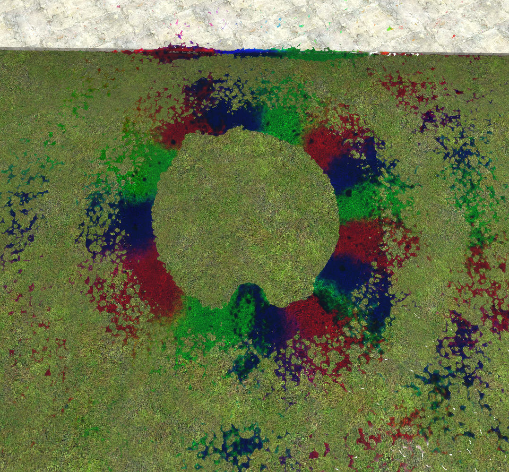

   
    
   <a href="https://github.com/yogwoggf/gelly/releases">Grab the GMod addon</a>
    
    
   
 

This is the Gelly Mod Template / Example Mods Repository.

- [Contains](#contains)
- [Examples](#examples)

# Contains

This repo contains:
- A Empty Gelly Mod Template
- Many examples for you to explore for what to do with Gelly's API

# Examples

## Rainbow Watergun

Rainbow Watergun is a very simple weapon mod that copies the normal Gelly Gun and makes it shoot the fluid in rainbow colors depending on the current time variable.

 

    
     
    
 